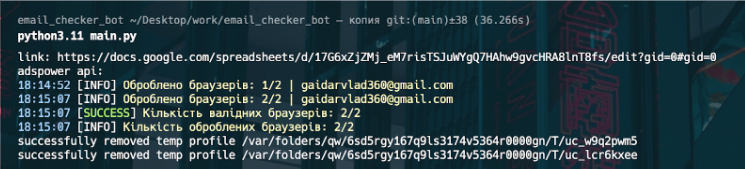
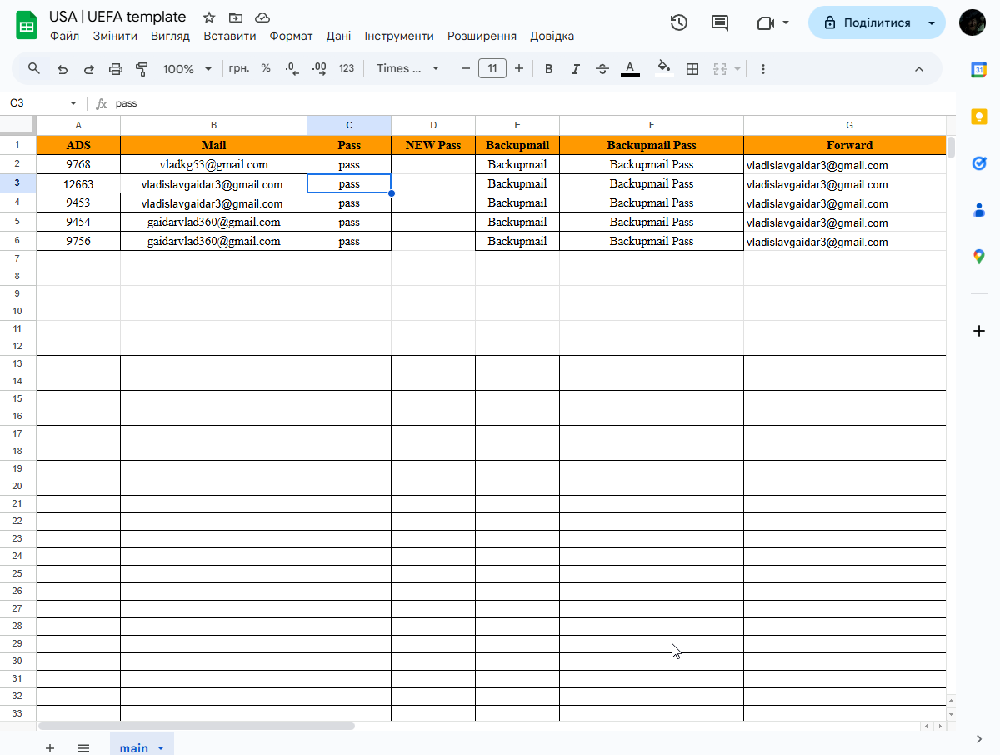

Registrates accounts on uefa.com based on spreadsheets data and output results in console

# How it works
1. parses data from spreadsheets
2. it opens up adspower sunbrowser instance
3. opens up uefa.com and clicks Log in
4. clicks "Sign in with Google" if there are no accounts already registered in specified browser
5. after creating google accounts it changes personal info on uefa.com based on spreadsheets data
6. updates favourite teams in uefa.com page
6. if account registered, moves to the next browser and account

# Requirements

- Running Google Chrome Instance
- Google Sheets
- Google Sheets API token
- Python 3
- Adspower
- Proxy (optional)

# Get Started

1. install requirements ```pip install -r requirements.txt``` or [install.bat](install.bat)
2. setup you Google Sheets following the example in [Spreadsheets Configuration](#spreadsheets-configuration)
3. run bot with ```python -m main.py``` [run.bat](run.bat)

# Error logs

all exceptions and errors are written in console output after processing row

# Console Output sample


**Line 1:** Required spreadsheets link with configurations \
**Line 2:** Adspower API, can be set empty for http://local.adspower.net:50325 \
**Line 3-4:** Time and information about succesfully processed certain row \
**Line 5:** Line with information of successfuly validated browsers amount \
**Line 6:** Overall processed browsers

# Spreadsheets Configuration

create google sheets with following attributes:

|Name|Description|Available Values|Required|
|----|-----------|----------------|--------|
|ADS|Adspower browser identification|Numeric values (e.g. 9768, 12663)|Yes|
|Mail|Primary email address|Valid emails (e.g. vladkg53@gmail.com, vladislavgaidar3@gmail.com)|Yes|
|Pass|Account password|String (e.g. "pass")|Yes|
|First Name|User’s first name|Alphabetical string (e.g. "Jin-woo")|Yes|
|Last Name|User’s last name|Alphabetical string (e.g. "Jang")|Yes|
|Db|Date of birth or unique identifier detail|Date or identifier string (e.g. "07.12.1993" or "950114-1234580")|Yes|
|Uefa Pass|UEFA-related password or credential|String (e.g. "google")|Yes|
|Обирати|Name of faviourite team's country|String: "Checzh"|Yes|

## Google Sheets configuration sample


# Troubleshooting

|Error|Reason|Solution|How Bot handles it|
|-----|------|--------|------------------|
|Uefa зареєстрований під іншою поштою.|uefa account already registed in specified browser|change gmail in spreadsheets manually|moves on to the next browser and account|
|Gmail аккаунту немає в adspower браузері.|gmail account does not exists in ads, incorrect name of gmail or some other gmail in adspower browser exists|check adspower browser and spreadsheets on mistakes|moves on to the next browser and account|
|Не вдалось увійти в gmail аккаунт.|gmail account logged off, gmail acount is blocked, captcha appeared|manually move out related row from spreadsheet or change to another gmail|moves on to the next browser and account|
|В одному з браузерів сталася непередбачувана помилка|somethign's not related to the above exceptions happened|manually check the reason|moves on to the next browser and account|
